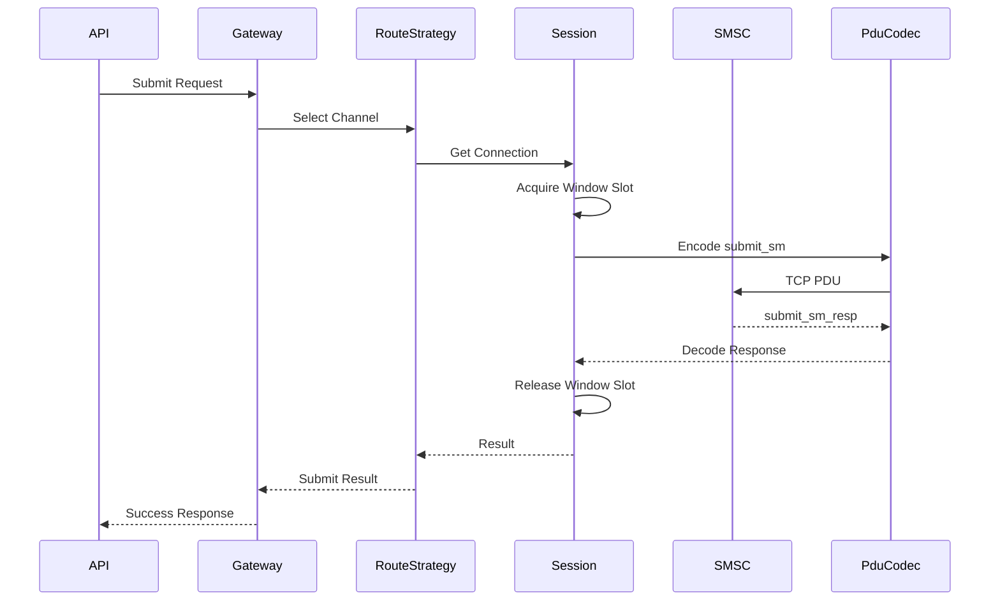
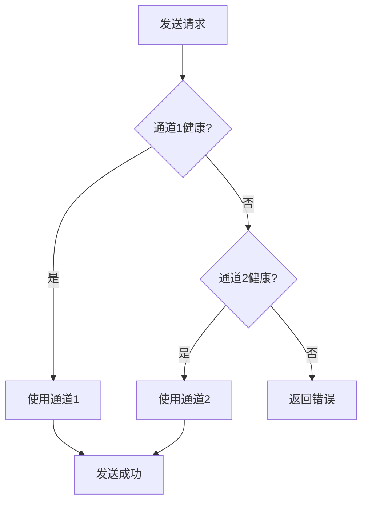

# SMPP Gateway 架构文档

## 1. 系统概述

SMPP Gateway 是一个企业级短信网关平台，基于 .NET 8 构建，提供高性能、高可用的 SMPP 协议接入能力。

### 1.1 设计目标

- **高性能**: 支持 500-1000 TPS
- **高可用**: 熔断器、限流器、自动重连
- **可扩展**: 多通道、多用户、灵活路由
- **可观测**: Prometheus 指标、健康检查

---

## 2. 整体架构

```
┌─────────────────────────────────────────────────────────────┐
│                         接入层                               │
│                   Vue 3 Admin UI                              │
└─────────────────────┬───────────────────────────────────────┘
                      │ HTTP/REST
┌─────────────────────▼───────────────────────────────────────┐
│                     SmppGateway (.NET 8)                     │
│  ┌─────────────────────────────────────────────────────────┐ │
│  │                    API Gateway                          │ │
│  │  ┌───────────┬────────────┬───────────┬────────────────┐│ │
│  │  │  Admin    │    User    │    Sms    │   Health        ││ │
│  │  │ Controller│ Controller │ Controller│ Controller     ││ │
│  │  └───────────┴────────────┴───────────┴────────────────┘│ │
│  └─────────────────────────────────────────────────────────┘ │
│  ┌─────────────────────────────────────────────────────────┐ │
│  │                    Services Layer                        │ │
│  │  ┌───────────┬────────────┬───────────┬────────────────┐│ │
│  │  │ Billing   │ Permission │  Alert    │   Webhook      ││ │
│  │  │ Service   │  Service   │  Service  │   Service      ││ │
│  │  └───────────┴────────────┴───────────┴────────────────┘│ │
│  └─────────────────────────────────────────────────────────┘ │
└────────┬──────────────────────┬──────────────────────────────┘
         │                      │
┌────────▼────────┐    ┌────────▼────────┐    ┌──────────────┐
│   SmppClient   │    │   SmppStorage    │    │   RabbitMQ   │
│                │    │                  │    │              │
│ ┌────────────┐ │    │ ┌────────────┐  │    │ ┌──────────┐ │
│ │ Connection  │ │    │ │ DbContext  │  │    │ │ Queue    │ │
│ │ Manager    │ │    │ └────────────┘  │    │ │ Adapter  │ │
│ ├────────────┤ │    │ ┌────────────┐  │    │ └──────────┘ │
│ │  Session   │ │    │ │ Repository │  │    └──────────────┘
│ │   Pool    │ │    │ │   Layer    │  │
│ ├────────────┤ │    │ └────────────┘  │
│ │  Protocol  │ │    │                  │
│ │   Codec    │ │    │                  │
│ ├────────────┤ │    │                  │
│ │  Window    │ │    │                  │
│ │  Manager   │ │    │                  │
│ ├────────────┤ │    │                  │
│ │  Circuit   │ │    │                  │
│ │  Breaker   │ │    │                  │
│ └────────────┘ │    └──────────────────┘
└────────────────┘
```

---

## 3. 核心组件

### 3.1 SmppGateway

API 网关层，负责 HTTP 请求处理、认证、业务调度。

**控制器**:
| 控制器 | 路径 | 说明 |
|--------|------|------|
| AdminController | /api/v1/admin/* | 管理员操作 |
| UserController | /api/v1/user/* | 用户操作 |
| SmsController | /api/v1/sms/* | 短信发送 |
| HealthController | /healthz | 健康检查 |

**服务**:
| 服务 | 说明 |
|------|------|
| BillingService | 计费扣费 |
| PermissionService | 权限校验 |
| AlertService | 告警管理 |
| WebhookNotificationService | Webhook 回调 |

### 3.2 SmppClient

SMPP 协议客户端，负责与 SMSC 通信。

**连接管理**:
```
ConnectionManager
├── SessionFactory
├── StateMachine (CLOSED → CONNECTING → BINDING → BOUND)
└── Session[]
    ├── WindowManager (滑动窗口控制)
    ├── SequenceManager (序列号管理)
    └── PduCodec (PDU 编解码)
```

**核心流程**:



### 3.3 SmppStorage

数据持久化层，使用 Entity Framework Core。

**实体**:
- User - 用户信息
- SmppAccount - SMPP 账号配置
- SmsSubmit - 提交记录
- DlrRecord - 状态报告
- PriceConfig - 价格配置
- Alert - 告警记录

---

## 4. 路由策略

### 4.1 权重路由

根据通道权重比例分发流量：

```csharp
var totalWeight = accounts.Sum(a => a.Weight);
var random = new Random().Next(totalWeight);
foreach (var account in accounts)
{
    random -= account.Weight;
    if (random <= 0) return account;
}
```

### 4.2 故障切换

主通道故障时自动切换到备用通道：



---

## 5. 弹性机制

### 5.1 滑动窗口

每个 Session 维护独立窗口，控制并发请求数：

| 配置 | 默认值 | 说明 |
|------|--------|------|
| DefaultWindow | 50 | 默认窗口大小 |
| MinWindow | 10 | 最小窗口 |
| MaxWindow | 200 | 最大窗口 |
| AdjustInterval | 30s | 调整间隔 |

**动态调整**:
- 响应延迟升高 → 自动减小窗口
- 响应正常 → 逐步增大窗口

### 5.2 熔断器

```
         ┌──────────────────────────────────────┐
         │              Circuit Breaker          │
         ├──────────────────────────────────────┤
         │                                      │
         │   CLOSED ──失败次数超限──> OPEN      │
         │     ↑              │                 │
         │     │   探测成功    │                 │
         │     │<────── HALF_OPEN ───探测失败────┘
         │     │
         │     │  探测成功
         │     └──────────┘
         │                                      │
         └──────────────────────────────────────┘
```

### 5.3 限流器

- 每账号独立 TPS 限制
- 全局 TPS 限制
- 令牌桶算法

---

## 6. 协议支持

### 6.1 PDU 类型

| PDU | 方向 | 支持 |
|-----|------|------|
| bind_transceiver | ↔ | ✅ |
| submit_sm | → | ✅ |
| submit_sm_resp | ← | ✅ |
| deliver_sm | ← | ✅ |
| deliver_sm_resp | → | ✅ |
| enquire_link | ↔ | ✅ |
| unbind | ↔ | ✅ |

### 6.2 长短信拆分

| 编码 | 单条上限 | 拆分后 |
|------|----------|--------|
| 7-bit (GSM7) | 160 字符 | 153 字符/段 |
| 8-bit | 140 字符 | 134 字符/段 |
| 16-bit (UCS2) | 70 字符 | 67 字符/段 |

---

## 7. 监控指标

### 7.1 业务指标

| 指标 | 类型 | 说明 |
|------|------|------|
| `smpp_connected_sessions` | Gauge | 连接会话数 |
| `smpp_submit_tps` | Gauge | 提交 TPS |
| `smpp_submit_success_total` | Counter | 成功总数 |
| `smpp_submit_fail_total` | Counter | 失败总数 |
| `smpp_dlr_received_total` | Counter | DLR 总数 |
| `smpp_dlr_delay_seconds` | Histogram | DLR 延迟分布 |

### 7.2 系统指标

| 指标 | 类型 | 说明 |
|------|------|------|
| `smpp_api_request_total` | Counter | API 请求数 |
| `smpp_api_request_duration_seconds` | Histogram | API 延迟 |
| `smpp_window_usage` | Gauge | 窗口使用率 |
| `smpp_circuit_breaker_state` | Gauge | 熔断状态 |

---

## 8. 健康检查

### 8.1 检查项

| 检查项 | 说明 |
|--------|------|
| Database | PostgreSQL 连接 |
| Queue | RabbitMQ 连接 |
| SmppSessions | SMPP 会话状态 |

### 8.2 端点

- `/healthz` - 完整健康检查
- `/healthz/live` - Liveness 探针
- `/healthz/ready` - Readiness 探针

---

## 9. 配置热更新

配置文件 (`config.json`) 变更自动重载：


---

## 10. 安全性

### 10.1 认证机制

| 类型 | 说明 |
|------|------|
| API Key | 用户身份认证 |
| Admin Key | 管理员身份认证 |
| Session | JWT Token (可选) |

### 10.2 数据保护

- API Key 加密存储
- 运营商密码加密存储
- 日志脱敏处理
