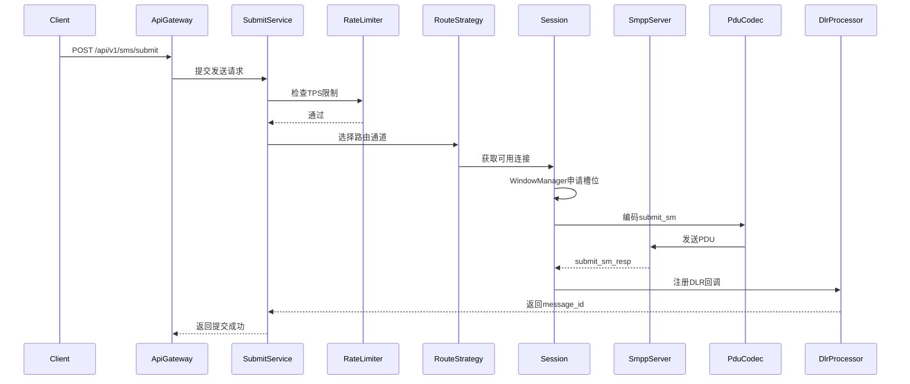
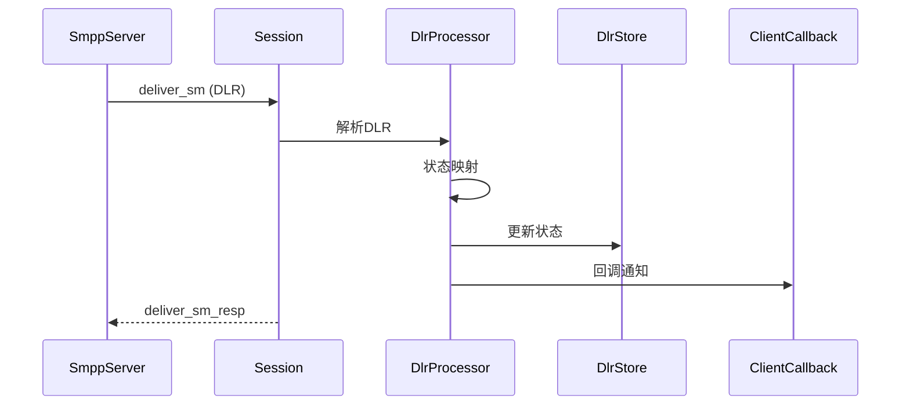

# SMPP 客户端平台 技术设计方案

需求名称：smpp-client-platform  
更新日期：2026-04-07

---

## 概述

基于 C# .NET 8 编写的商用级 SMPP 客户端平台，支持多通道、用户隔离、计费、多租户等完整能力。

**目标**：v1 稳定版 500-1000 TPS

---

## 完整架构

```
SmppClientPlatform
├── 网关层 (Gateway)
│   ├── ApiGateway           # HTTP API入口
│   └── SmppGateway          # SMPP协议网关
│
├── 连接层 (Connection)
│   ├── ConnectionManager     # TCP连接管理
│   ├── SessionPool          # 会话池
│   ├── StateMachine         # 状态机
│   ├── WindowManager        # 窗口控制
│   └── SequenceManager      # 序列号管理
│
├── 协议层 (Protocol)
│   ├── PduCodec             # PDU编解码
│   ├── LongMessageProcessor # 长短信
│   └── DlrProcessor        # 状态报告
│
├── 业务层 (Business)
│   ├── SubmitService        # 发送服务
│   ├── UserService          # 用户管理
│   ├── AccountService       # 账号管理
│   ├── PricingService       # 计费服务
│   └── RouteStrategy       # 路由策略
│
├── 队列层 (Queue)
│   ├── RabbitMqAdapter      # RabbitMQ队列
│   ├── SubmitQueue          # 发送队列
│   ├── DlrQueue             # DLR回执队列
│   └── DeadLetterQueue      # 死信队列
│
├── 稳定性 (Resilience)
│   ├── RateLimiter          # TPS控制
│   ├── CircuitBreaker       # 熔断器
│   └── RetryPolicy          # 重试策略
│
├── 监控层 (Observability)
│   ├── MetricsCollector     # Prometheus指标
│   └── HealthCheck          # 健康检查
│
└── 存储层 (Storage)
    ├── UserStore            # 用户存储
    ├── AccountStore         # 账号配置存储
    ├── DlrStore             # 状态报告存储
    └── PriceStore           # 价格配置存储
```

---

## 核心流程

### 发送短信流程



### DLR处理流程



---

## 组件设计

### 1. 连接层

#### StateMachine（状态机）

| 状态 | 说明 |
|------|------|
| CLOSED | 初始/已关闭 |
| CONNECTING | 正在连接 |
| BINDING | 正在认证 |
| BOUND | 已绑定 |
| UNBINDING | 正在断开 |

#### WindowManager

- 默认窗口：50（可配置10-200）
- 实时监控窗口使用率
- 窗口满时阻塞发送

#### SequenceManager

- 全局递增：0x00000001 - 0xFFFFFFFF
- 线程安全
- 用于request/response匹配

### 2. 协议层

#### PDU支持

| PDU | 支持 |
|-----|------|
| bind_transceiver | ✅ |
| submit_sm / resp | ✅ |
| deliver_sm / resp | ✅ |
| enquire_link / resp | ✅ |
| unbind / resp | ✅ |

#### TLV参数

| TLV | 说明 |
|-----|------|
| message_payload | 长短信 |
| receipted_message_id | DLR关联ID |
| message_state | 状态 |
| network_error_code | 错误码 |

#### 长短信

- 自动拆分：>70字符(GSM7)或140字符(UCS2)
- UDH格式：SAR reference + segment + total
- 支持message_payload单条模式

### 3. 业务层

#### UserService（用户管理）

- 用户注册/认证
- API Key管理
- 用户隔离

#### AccountService（账号管理）

- SMPP账号配置（host/port/system_id/password）
- 多通道配置
- 通道权重

#### PricingService（计费服务）

- 按通道计价
- 按方向计价（国内/国际）
- 账单生成

#### RouteStrategy（路由策略）

| 策略 | 说明 |
|------|------|
| 权重路由 | 按权重比例分发 |
| 优先级路由 | 高优先级优先 |
| 最低价格路由 | 选最便宜通道 |
| 故障切换 | 自动切换备用通道 |

### 4. 队列层（RabbitMQ）

#### RabbitMqAdapter

- 使用RabbitMQ.Client库
- 支持消息持久化，不丢消息
- 支持消息确认（Confirm）
- 解耦发送与业务

**队列设计**：
| 队列名 | 说明 |
|--------|------|
| sms.submit | 待发送消息 |
| sms.dlr | 状态报告 |
| sms.dlx | 死信队列 |

**Exchange配置**：
- exchange.submit：发送交换机（direct）
- exchange.dlr：回执交换机（fanout）

### 5. 稳定性层

#### RateLimiter（TPS控制）

- 每账号独立TPS限制
- 全局TPS限制
- 令牌桶算法

#### CircuitBreaker（熔断器）

- 连续失败N次触发熔断
- 熔断后定期探测恢复
- 状态：Closed/Open/HalfOpen

#### RetryPolicy（重试策略）

| 错误码 | 重试 |
|--------|------|
| ESME_RSYSERR | ✅ |
| ESME_RTHROTTLED | ✅ |
| ESME_RMSGQFUL | ✅ |
| 其他 | ❌ |

- 最多2次
- 指数退避：1s → 3s

### 6. 监控层

#### MetricsCollector

| 指标 | 类型 | 说明 |
|------|------|------|
| smpp_connected_sessions | Gauge | 连接数 |
| smpp_reconnect_total | Counter | 重连次数 |
| smpp_submit_tps | Gauge | 提交TPS |
| smpp_submit_success | Counter | 成功数 |
| smpp_submit_fail | Counter | 失败数 |
| smpp_dlr_received | Counter | DLR数 |
| smpp_dlr_delay_seconds | Histogram | DLR延迟 |
| smpp_window_usage | Gauge | 窗口使用率 |
| smpp_queue_length | Gauge | 队列长度 |
| smpp_circuit_breaker | Gauge | 熔断状态 |

### 7. 存储层

#### DlrStore

- message_id → 请求信息映射
- 状态：PENDING/DELIVRD/FAILED/UNKNOWN
- 超时时间可配置

---

## 数据模型

### User（用户）

```csharp
public class User
{
    public Guid Id { get; set; }
    public string Username { get; set; }
    public string ApiKey { get; set; }
    public decimal Balance { get; set; }
    public UserStatus Status { get; set; }
    public DateTime CreatedAt { get; set; }
}
```

### SmppAccount（SMPP账号）

```csharp
public class SmppAccount
{
    public Guid Id { get; set; }
    public string SystemId { get; set; }
    public string Password { get; set; }
    public string Host { get; set; }
    public int Port { get; set; }
    public SmppAccountType Type { get; set; }  // Transmitter/Receiver/Transceiver
    public int Weight { get; set; }
    public int MaxTps { get; set; }
    public ChannelStatus Status { get; set; }
}
```

### SmsSubmit（提交记录）

```csharp
public class SmsSubmit
{
    public Guid Id { get; set; }
    public Guid UserId { get; set; }
    public string Mobile { get; set; }
    public string Content { get; set; }
    public string MessageId { get; set; }  // 上游message_id
    public SmsStatus Status { get; set; }
    public Guid AccountId { get; set; }
    public DateTime SubmitTime { get; set; }
    public DateTime? DlrTime { get; set; }
}
```

---

## API设计

### 短信发送

```
POST /api/v1/sms/submit
Headers:
  X-Api-Key: <api_key>
Body:
{
  "mobile": "13800138000",
  "content": "您的验证码是1234",
  "ext": "12345"
}
Response:
{
  "code": 0,
  "message": "success",
  "data": {
    "message_id": "abc123",
    "mobile": "13800138000"
  }
}
```

### 批量发送

```
POST /api/v1/sms/batch
Body:
{
  "list": [
    {"mobile": "13800138000", "content": "xxx"},
    {"mobile": "13800138001", "content": "yyy"}
  ]
}
```

### 用户余额

```
GET /api/v1/user/balance
Response:
{
  "balance": 1000.00
}
```

### 通道状态

```
GET /api/v1/channels/status
Response:
{
  "channels": [
    {"name": "channel-1", "status": "healthy", "tps": 50}
  ]
}
```

---

## 技术选型

| 组件 | 技术 | 说明 |
|------|------|------|
| 运行时 | .NET 8 | 最新LTS |
| Web框架 | ASP.NET Core 8 | 高性能 |
| 队列 | RabbitMQ.Client | 消息队列 |
| ORM | EF Core 8 | 数据库访问 |
| 数据库 | PostgreSQL | 存储用户、账单 |
| 缓存 | Redis | Session缓存 |
| 日志 | Microsoft.Extensions.Logging | 标准化 |
| 指标 | prometheus-net | 监控 |

---

## 项目结构

```
src/
├── SmppClientPlatform/
│   ├── Program.cs
│   ├── appsettings.json
│   │
│   ├── Gateway/
│   │   ├── ApiGateway.cs
│   │   └── SmppGateway.cs
│   │
│   ├── Connection/
│   │   ├── ConnectionManager.cs
│   │   ├── Session.cs
│   │   ├── SessionPool.cs
│   │   ├── StateMachine.cs
│   │   ├── WindowManager.cs
│   │   └── SequenceManager.cs
│   │
│   ├── Protocol/
│   │   ├── PduCodec.cs
│   │   ├── PduTypes.cs
│   │   ├── TlvTypes.cs
│   │   ├── LongMessageProcessor.cs
│   │   └── DlrProcessor.cs
│   │
│   ├── Business/
│   │   ├── SubmitService.cs
│   │   ├── UserService.cs
│   │   ├── AccountService.cs
│   │   ├── PricingService.cs
│   │   └── RouteStrategy.cs
│   │
│   ├── Queue/
│   │   ├── RabbitMqAdapter.cs
│   │   ├── QueueNames.cs
│   │   └── DeadLetterHandler.cs
│   │
│   ├── Resilience/
│   │   ├── RateLimiter.cs
│   │   ├── CircuitBreaker.cs
│   │   └── RetryPolicy.cs
│   │
│   ├── Observability/
│   │   ├── MetricsCollector.cs
│   │   └── HealthCheck.cs
│   │
│   ├── Storage/
│   │   ├── SmppDbContext.cs
│   │   ├── UserStore.cs
│   │   ├── AccountStore.cs
│   │   ├── DlrStore.cs
│   │   └── PriceStore.cs
│   │
│   └── Models/
│       ├── User.cs
│       ├── SmppAccount.cs
│       ├── SmsSubmit.cs
│       └── DlrRecord.cs
│
├── SmppClientPlatform.Tests/
│   ├── PduCodecTests.cs
│   ├── WindowManagerTests.cs
│   ├── StateMachineTests.cs
│   └── SubmitServiceTests.cs
│
└── SmppClientPlatform.sln
```

---

## 正确性属性

1. **序列号唯一**：每次submit_sm使用唯一sequence_number
2. **窗口控制**：pending请求不超过窗口上限
3. **DLR匹配**：通过sequence_number精确匹配
4. **用户隔离**：每用户独立TPS、余额
5. **熔断保护**：故障通道自动隔离

---

## 错误处理

| 场景 | 处理 |
|------|------|
| 网络中断 | 自动重连，指数退避 |
| bind失败 | 重试3次，间隔2s/4s/8s |
| ESME_RTHROTTLED | 降速等待 |
| 窗口满 | 阻塞等待，超时抛异常 |
| DLR超时 | 标记UNKNOWN |
| 熔断触发 | 切换到备用通道 |

---

## 部署架构

```
                    ┌─────────────┐
                    │   Nginx     │
                    │  (负载均衡)  │
                    └──────┬──────┘
                           │
              ┌────────────┼────────────┐
              │            │            │
        ┌─────▼─────┐ ┌────▼────┐ ┌─────▼─────┐
        │  API-01   │ │  API-02 │ │  API-03   │
        │ .NET 8    │ │ .NET 8  │ │ .NET 8    │
        └─────┬─────┘ └────┬────┘ └─────┬─────┘
              │            │            │
              └────────────┼────────────┘
                           │
        ┌──────────────────┼──────────────────┐
        │                  │                  │
   ┌────▼────┐       ┌────▼────┐       ┌────▼────┐
   │ Redis   │       │  PostgreSQL │   │ RabbitMQ│
   │ Session │       │   Storage   │   │ (v2)    │
   └─────────┘       └─────────────┘   └─────────┘
                           │
        ┌──────────────────┼──────────────────┐
        │                  │                  │
   ┌────▼────┐       ┌────▼────┐       ┌────▼────┐
   │ SMPP-1  │       │ SMPP-2  │       │ SMPP-3  │
   │ 运营商1 │       │ 运营商2  │       │ 运营商3  │
   └─────────┘       └─────────┘       └─────────┘
```

---

## 测试策略

| 级别 | 范围 | 工具 |
|------|------|------|
| 单元 | PDU编解码、窗口、状态机 | xUnit + Moq |
| 集成 | 模拟SMPP服务器收发 | TestContainers |
| 性能 | 500-1000 TPS基准 | BenchmarkDotNet |
| 故障 | 断连、重连、熔断 | 模拟器 |

---

## 下一步计划

1. **Phase 1**：核心PDU编解码 + Session管理
2. **Phase 2**：发送服务 + DLR处理
3. **Phase 3**：多通道路由 + 熔断
4. **Phase 4**：API网关 + 用户体系
5. **Phase 5**：计费 + 监控
